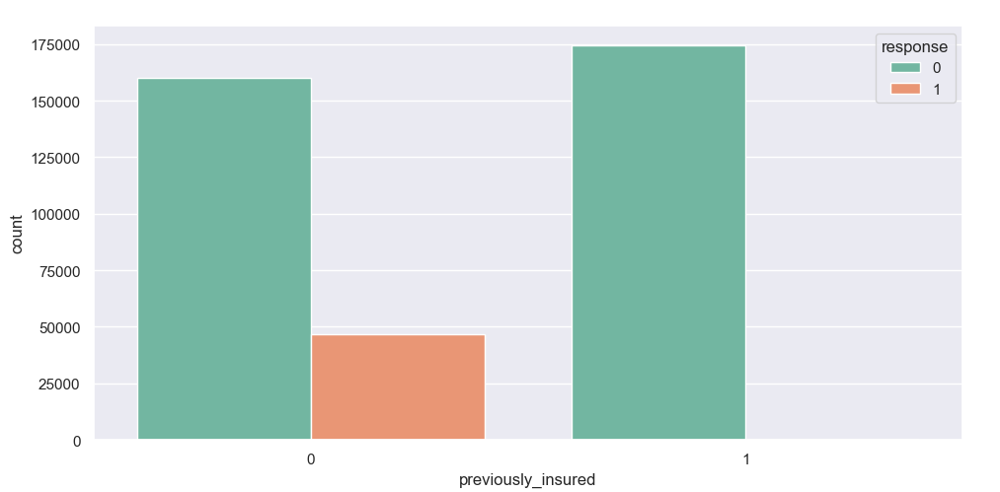
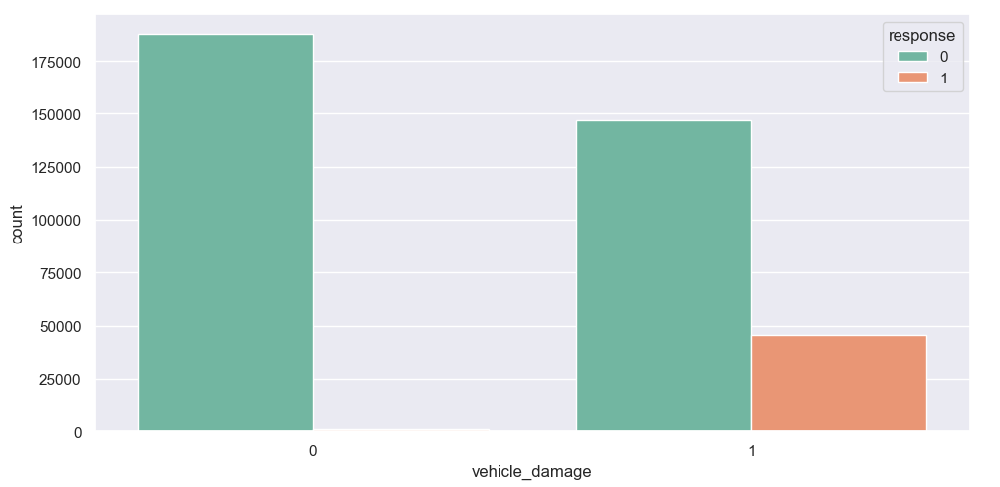
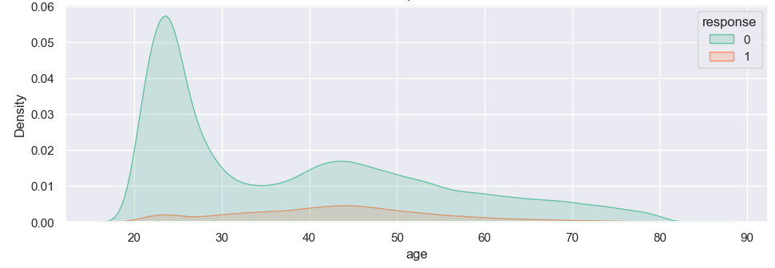
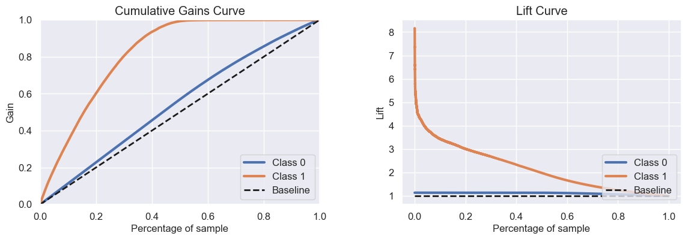
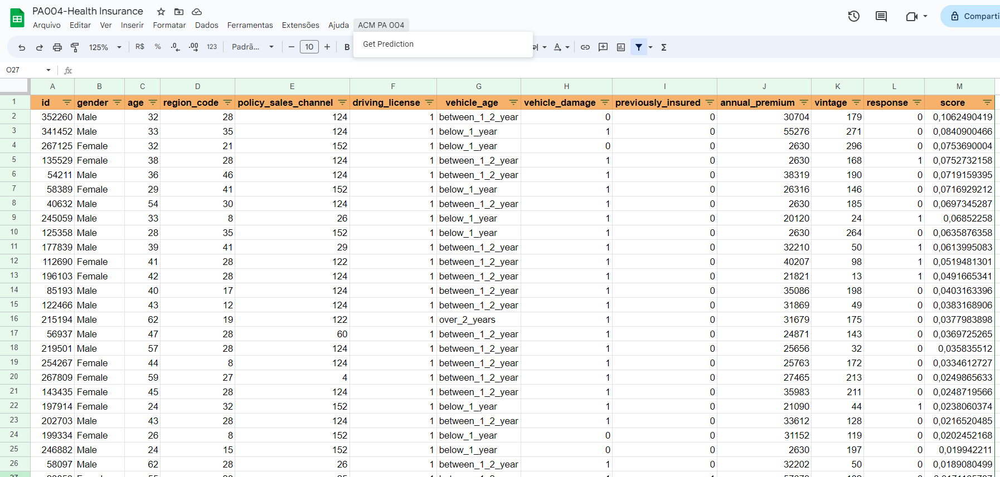

# Health Insurance Cross Sell Prediction

Esse projeto foi inspirado pelo desafio "Health Insurance Cross Sell Prediction" publicado no kaggle (https://www.kaggle.com/datasets/anmolkumar/health-insurance-cross-sell-prediction). 

##### Projeto realizado por Ana Camila Mamede (anacamilamamede@gmail.com).

# Contexto
Esse projeto tem o objetivo de atender a demanda de uma seguradora que já fornece plano de saúde para seus clientes, e precisa construir um modelo para prever se os segurados também terão interesse em seguros de veículos. Com os recursos limitados para contatar os potenciais clientes de seguro veicular, é preciso construir um ranking de clientes para melhorar o desempenho da campanha. Esse é um projeto de learning to rank (LTR).

# 1. Questão de negócio
Se a campanha de vendas do seguro veicular for aplicada em toda a base de clientes, o custo será altíssimo e sabe-se que uma boa parte dos clientes do seguro saúde não se interessam pelo seguro veicular. Portanto, o time de marketing decidiu, baseado no custo da campanha, que consegue entrar em contato com até 30% dos segurados do ano passado. Dessa maneira, a empresa deseja obter uma lista ordenada de clientes com maior probablidade de adquirir o seguro de veículo e assim maximizar a taxa de conversão de clientes.

# 2. Planejamento da solução

Quando cada cliente aderiu ao seguro de saúde no último ano também respondeu um formulário com diversos dados relevantes, esses dados serão utilizados para criação de um modelo de machine learning que irá predizer a propensão dos clientes de adquirir um seguro veicular. O produto final, será uma lista ordenada de clientes com maior probabilidade de adquirir o seguro de veículos.

Os dados disponíveis são apresentados na tabela a seguir, estão disponíveis dados demográficos (sexo, idade, tipo de código de região), veículos (idade do veículo, danos), apólice (premium, canal de atendimento), entre outros.

| Variável             | Descrição                                                                                                    |
|----------------------|--------------------------------------------------------------------------------------------------------------|
| id                   | ID único para cada cliente                                                                                   |
| Gender               | Gênero do cliente                                                                                            |
| Age                  | Idade do cliente                                                                                             |
| Driving_License      | 0 : Cliente não tem carteira de habilitação , 1 : Cliente tem carteira de habilitação                        |
| Region_Code          | Código único para a região do cliente                                                                        |
| Previously_Insured   | 1 : Cliente já possui seguro de veículo, 0 : Cliente não possui seguro de veículo                            |
| Vehicle_Age          | Idade do veículo                                                                                             |
| Vehicle_Damage       | 1 : Cliente teve seu veículo danificado no passado. 0 : Cliente não teve carro danificado no passado         |
| Annual_Premium       | Valor do prêmio do seguro que o cliente pagará no ano                                                        |
| Policy_Sales_Channel | Código anônimo do canal de divulgação ao cliente, por exemplo: por correio, por telefone, pessoalmente, etc. |
| Vintage              | Número de dias que o cliente é associado a empresa                                                           |
| Response             | 1 : Cliente está interessado, 0 : Cliente não está interessado                                               |

A estratégia utilizada para desenvolver esse projeto e resolver esse desafio é descrita a seguir:

**Passo 01 - Descrição dos dados**

O primeiro passo foi coletar os dados na plataforma Kaggle e entender os dados em relação a dimensão do banco de dados, tipos de cada atributo, identificação de dados faltantes e análise descritiva dos dados. 

**Passo 02 - Feature Engineering**

Na etapa de feature engineering as variáveis vehicle_age e vehicle_damage foram alteradas. A primeira foi alterada para o padrão snake_case (original ) e a segunda de 'Yes' e 'No' para 1 e 0, respectivamente.

**Passo 03 - Filtragem de atributos**

Logo após, foi analisado a necessidade de filtrar os dados baseada na variável driving_license, no entanto apenas 0.21% dos clientes não possuem carteira de habilitação e optou-se por deixá-los no banco de dados.

**Passo 04 - Análise Exploratória dos Dados**

A Análise Exploratória dos Dados foi dividida em 3 etapas: análise univariada, análise bivariada e análise multivariada. Dessa maneira, pode-se entender melhor a influência de algumas variáveis na decisão do cliente em adquirir um seguro veícular e trazer alguns insights relevantes.

**Passo 05 - Data Preparation**

Nesta etapa, foram aplicadas técnicas de normalização, rescaling e enconding nos dados. Além disso, os dados foram separados em treino e validação, para posterior avaliação da capacidade de predição do modelo final.

**Passo 06 - Feature Selection**

O próximo passo é selecionar as features relevantes que serão utilizadas no treinamento do modelo, para isso utilizou-se o algoritmo Extra-Trees Classifier, do pacote Scikit Learn. 7 features foram selecionadas, 3 foram excluídas.

**Passo 07 - Machine Learning Modelling**

Utilização de diferentes algoritmos de machine learning para treinamento, teste e validação do modelo através de cross-validation. KNeighbors Classifier, Logistic Regression, Random Forest Classifier, XGBoost Classifier e Extra-Trees Classifier foram os algoritmos aplicados e avaliados para a solução desse problema de classificação. 
A partir do método predict_proba foi possível ordenar a lista de clientes e plotar as curvas de ganho acumulado (cumulative gain curve) e elevação (lift curve) de cada modelo. Além disso, as métricas precision at k e recall at k foram utilizadas para quantificar o desempenho dos modelos e escolher o melhor.

**Passo 08 - Hyperparameter Fine Tunning**

O modelo que apresentou melhor performance para o dataset de validação foi o XGBoost, foi considerado a ordenação correta para k igual a 20%, 25%, 30%, 35% e 40%.
Efetuou-se o ajuste fino dos hiperparametros (hyperparameter fine tunning) porém não houve melhora significativa das métricas precision at k e recall at k.

**Passo 09 - Model Performance and Business values**

Como resultado final desse projeto, o gerente recebeu uma lista ordenada de clientes com maior probabilidade de adquirir um seguro veicular. Espera-se uma taxa de conversão de 78% ao entrar em contato com o top 30% dos clientes ordenados, e de pelo menos 90% se entrar em contato com o top 40% de clientes.

**Passo 10 - Deploy Modelo to Production**

Para facilitar o uso do modelo por toda a equipe da empresa, foi implementado uma API para previsão da propensão de cada cliente, que por sua vez foi introduzida em planilha online do Google Sheets. Dessa maneira, basta que o usuário insira uma tabela com os dados dos clientes na planilha e pressione um botão para que a o score de propensão de compra seja calculado e mostrado para o usuário, e a lista de clientes ordenadas do maior score para o menor.

# 4. Top 3 Data Insights4

**1) As pessoas que já tiveram veículos segurados geralmente não tem interesse em adquirir o seguro. O interesse pelo seguro é maior pelos que ainda não tiveram seguro.**

**2) As pessoas que já tiveram o carro danificado tem maior propensão a adquirir o seguro veicular.**

**3) A idade é relevante para a decisão de adquirir o seguro automotivo, clientes entre 40 e 50 anos são mais propensos a contratar o seguro.**

# 5. Machine Learning Model Applied

Foram treinados 5 modelos de machine learning para classificar os clientes de acordo com a sua propensão a adquirir o seguro. Todos os modelos foram treinados utilizando cross-validation sobre o dataset de validação, e os seus desempenhos são mostrados na tabela a seguir.

| Model Name          | Precision at K        | Recall at K           |
|---------------------|-----------------------|-----------------------|
|           KNN Model | 0.282889 +/- 0.002739 | 0.692582 +/- 0.005572 |
| Logistic regression | 0.279561 +/- 0.002626 | 0.686394 +/- 0.004395 |
|       Random Forest | 0.299152 +/- 0.001946 | 0.730601 +/- 0.002682 |
|             XGBoost | 0.319101 +/- 0.001832 |  0.77849 +/- 0.003779 |
|         Extra Trees | 0.292955 +/- 0.003853 | 0.719805 +/- 0.005118 |

O modelo escolhido para o treinamento final é o XGBoost, pois apresentou melhor resultado nas duas métricas avaliadas.

# 6. Machine Learning Model Performance
Após a escolha do modelo, efetuou-se o ajuste fino de seus hiperparâmetros de modo aleatório. Além disso, o modelo final foi treinado utilizando todos os dados de treino disponíveis, o resultado é apresentado na tabela a seguir. A partir das métricas apresentadas observa-se que houve uma certa melhora, porém não muito significante.

| Model Name    | Precision at K | Recall at K |
|---------------|----------------|-------------|
| XGBoost Tuned |       0.328756 |     0.80471 |

As curvas a seguir apresentam a curva de ganho acumulativo (Cumulative Gains Curve) e a curva de elevaçao (Lift Curve) para o modelo XGBoost Tuned. A figura a esquerda indica a porcentagem da classe positiva em relação ao tamanho total da base de dados, e como pode ser observado, entrando em contato com apenas 20% dos clientes ranqueados é possível alcançar cerca de 60% dos interessados em seguro veicular, já com 40% dos clientes ranqueados cerca de 90% dos interessados são alcançados. Portanto, o ranqueamento de clientes possibilita o controle de custos da campanha e desempenho da campanha publicitária.

A curva Lift indica quantas vezes o modelo de machine learning treinado é melhor que o modelo baseline, definido aleatoriamente. Com 20% dos clientes contatados, o modelo treinado é cerca de 3 vezes mais eficiente comparado com modelo aleatório.

# 7. Business Results
O principal resultado de negócio do modelo implementado é a conversão de 80% dos clientes interessados em seguro veicular abordando apenas 30% do total de clientes da base de dados da empresa. 

Para facilitar a usabilidade de qualquer pessoa na empresa, foi realizado o deploy do modelo no Render e disponibilizado em uma planilha de Google Sheets, de modo que o usuário pode inserir os dados dos clientes e fazer a predição do seu score de propensão a partir do botão 'Get Prediction'.

# 8. Conclusions

O objetivo de criar um ranking de clientes com maior propensão de compra para reduzir o custo de vendas do seguro veicular foi alcançado. O modelo criado permite possibilita uma redução significativa dos custos de captação de clientes, espera-se que esse modelo seja, ao menos, duas vezes mais eficiente que o modelo aleatório (baseline) utilizado atualmente na empresa, otimização o trabalho do time de vendas. 

# 9. Next Steps to Improve
- Criar novas features para melhorar o modelo e trazer novos insights.
- Obter mais dados sobre os clientes.
- Aplicar outros algoritmos de classificação.

